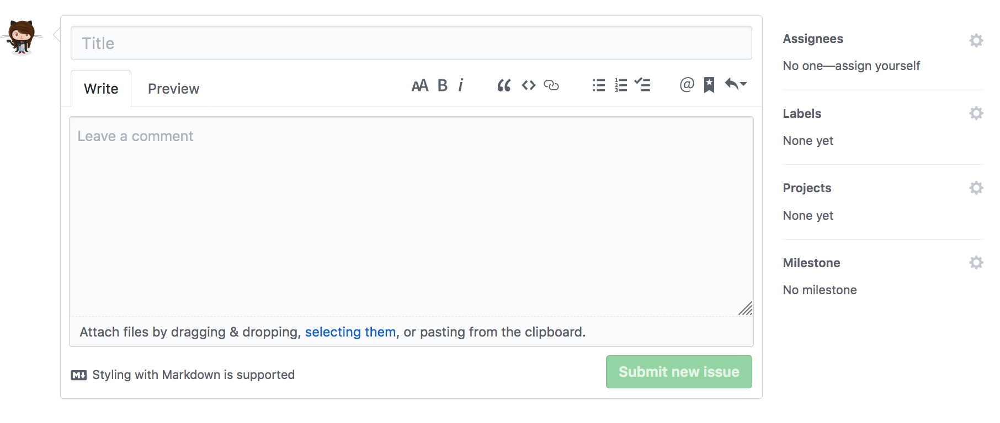
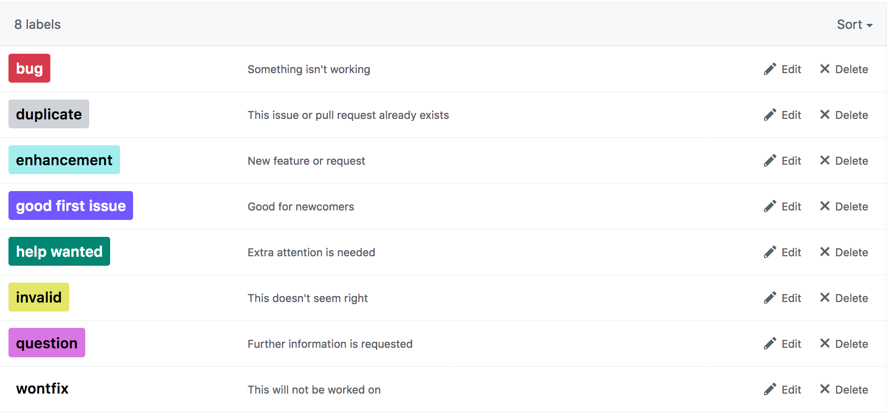

# Issue tracking

## What is it?

An issue tracking system is a software that manages and maintains a list of issues.

Issues are bugs to fix, or features to add. They have a modifiable status associated with them.

## Its functions

Issue-tracking systems fulfill different functions, in particular:

* Entering dysfunctions, errors and requests
* Distributing and assigning issues to persons in charge
* Assigning priority to each issue based on the overall importance of that issue
* Monitoring time spent and quality of work
* Collecting questions and answers for FAQs
* Maintaining an history of each change

## GitHub Issues

Create an issue

Default associated labels

## Practical

Work in pair, either as collaborator on one repository or using pull request mechanism to improve a 'bad' README.
1. First, list all the issues related to the README you can find creating as many issues as you think necessary,
1. then, prioritise these issues,
1. assign the person in your team capable of solving some (spread the workload equally between you) and
1. finally try to solve the most import ones assigned to you.
